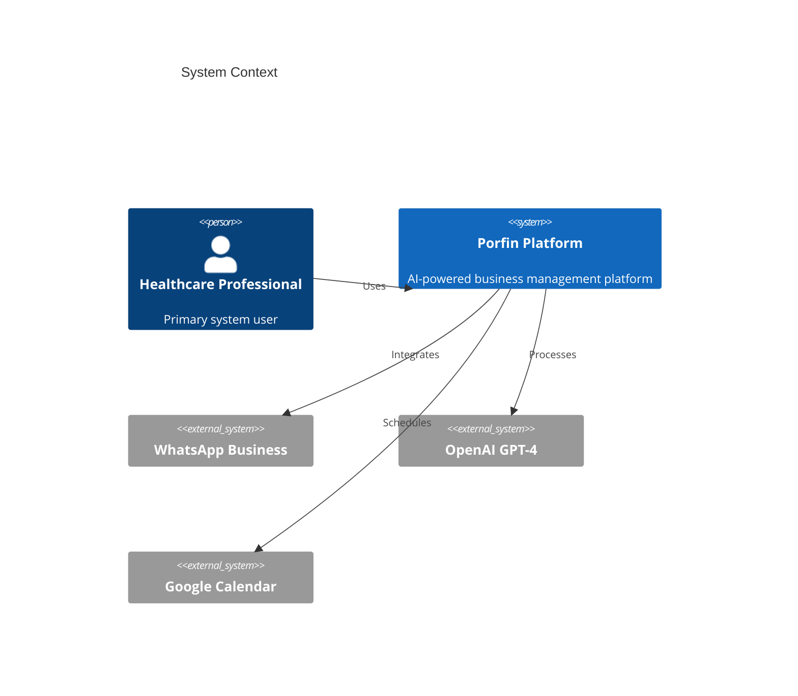

# Porfin - AI-Powered Healthcare Business Management Platform

[](./LICENSE)
[](./docs)
[](./src/backend)
[](./src/web)

Porfin is an AI-powered business management platform designed specifically for healthcare professionals in Brazil. The platform leverages artificial intelligence to optimize customer journeys and automate business processes through WhatsApp integration, enabling healthcare providers to convert more leads, improve patient communication, and grow their practices efficiently.

## 🚀 Key Features

- **WhatsApp Business Integration**: Seamless communication with patients through official WhatsApp Business API
- **AI Virtual Assistants**: GPT-4 powered conversational agents for automated patient interactions
- **Campaign Management**: Automated message campaigns with advanced targeting
- **Business Analytics**: Comprehensive insights into practice performance
- **Appointment Scheduling**: Integrated calendar management with Google Calendar
- **LGPD Compliant**: Full compliance with Brazilian data protection regulations

## 🏗️ System Architecture

### Technology Stack

- **Frontend**: Next.js 13+ with TailwindCSS
- **Backend**: Python FastAPI with async support
- **Database**: Google Cloud Firestore
- **Cache**: Redis 6.x
- **AI**: OpenAI GPT-4
- **Infrastructure**: Google Cloud Platform
- **Messaging**: WhatsApp Business API/Baileys
- **Authentication**: Firebase Auth

### High-Level Architecture



## 🛠️ Prerequisites

### Backend Development
- Python 3.11+
- Poetry 1.5+
- Docker 24.0+

### Frontend Development
- Node.js 18+
- pnpm 8.0+
- Docker 24.0+

### Infrastructure
- Google Cloud SDK
- Terraform 1.5+
- kubectl

## 📦 Repository Structure

```
porfin/
├── src/
│   ├── backend/          # FastAPI backend service
│   └── web/             # Next.js frontend application
├── infrastructure/
│   ├── terraform/       # Infrastructure as Code
│   ├── kubernetes/      # Container orchestration
│   └── docker/         # Container definitions
├── docs/               # Project documentation
└── .github/           # GitHub workflows and templates
```

## 🚀 Getting Started

1. **Clone the repository**
```bash
git clone https://github.com/your-org/porfin.git
cd porfin
```

2. **Backend Setup**
```bash
cd src/backend
poetry install
poetry run pre-commit install
poetry run python -m pytest
```

3. **Frontend Setup**
```bash
cd src/web
pnpm install
pnpm run dev
```

4. **Infrastructure Setup**
```bash
cd infrastructure/terraform
terraform init
terraform plan
```

## 🔒 Security Features

- **Authentication**: Firebase Auth with MFA support
- **Authorization**: Role-based access control (RBAC)
- **Encryption**: TLS 1.3 for data in transit
- **Compliance**: LGPD and healthcare data protection
- **Monitoring**: Continuous security scanning and audit logging

## 🚢 Deployment

### Environments
- **Development**: Local development with hot-reload
- **Staging**: Pre-production environment for testing
- **Production**: Live environment with high availability

### Deployment Strategies
- Blue-Green deployment for zero-downtime updates
- Canary releases for controlled rollouts
- Automated rollback capabilities

### Monitoring
- Datadog for application performance monitoring
- Cloud Logging for centralized logging
- Error tracking and alerting

## 🔍 Troubleshooting

### Common Issues
- Check the [Backend README](./src/backend/README.md) for backend-specific issues
- Refer to the [Frontend README](./src/web/README.md) for frontend-specific issues
- Review the [Infrastructure Documentation](./docs/infrastructure.md) for deployment issues

### Getting Help
- Open an issue on GitHub
- Check existing documentation in the `/docs` directory
- Contact support at support@porfin.com

## 🤝 Contributing

Please read our [Contributing Guidelines](./CONTRIBUTING.md) before submitting any changes.

## 📄 License

This project is proprietary software. See the [LICENSE](./LICENSE) file for details.

## 📚 Additional Documentation

- [Backend Service Documentation](./src/backend/README.md)
- [Frontend Application Documentation](./src/web/README.md)
- [API Documentation](./docs/api.md)
- [Infrastructure Guide](./docs/infrastructure.md)
- [Security Guidelines](./docs/security.md)

## 🌟 Support

For support inquiries, please contact:
- Email: support@porfin.com
- Documentation Version: 1.0.0