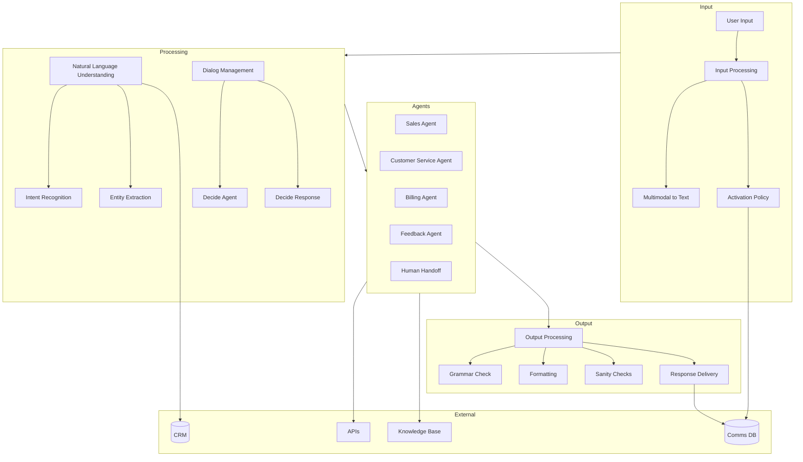
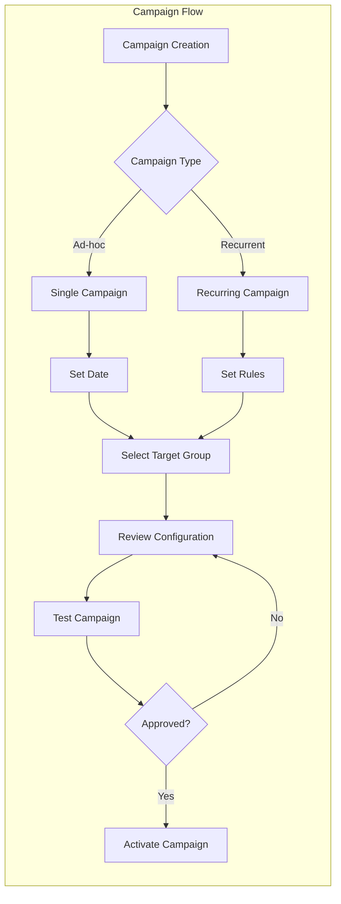
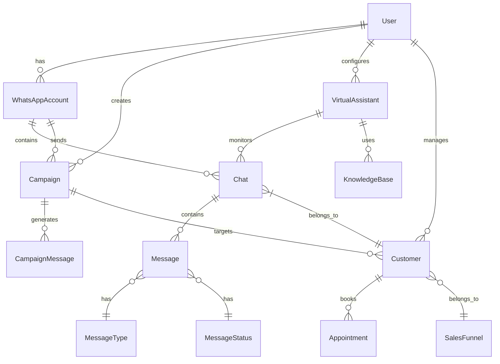
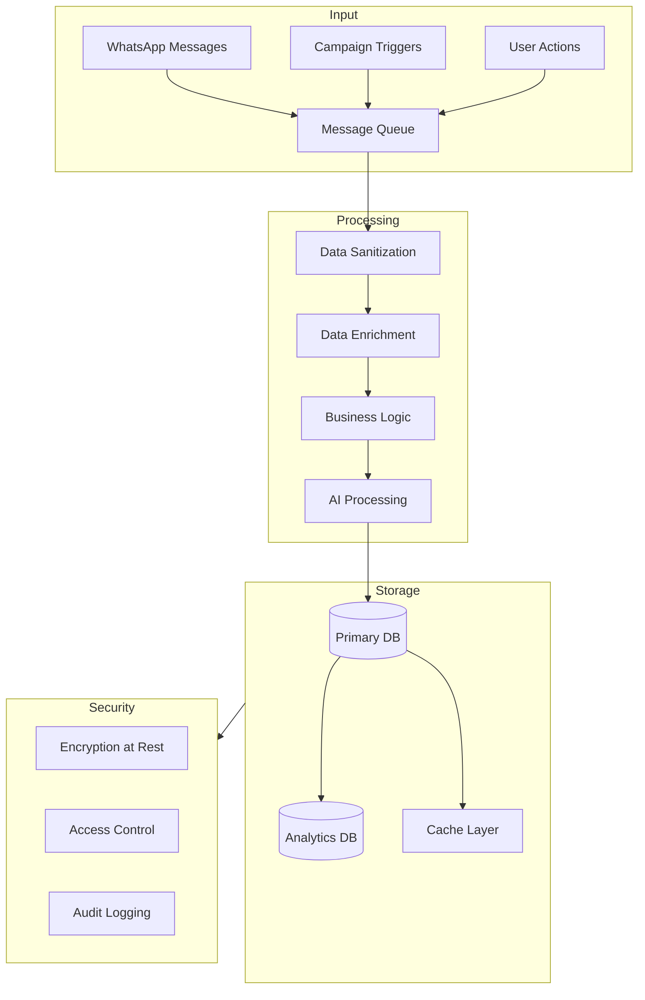
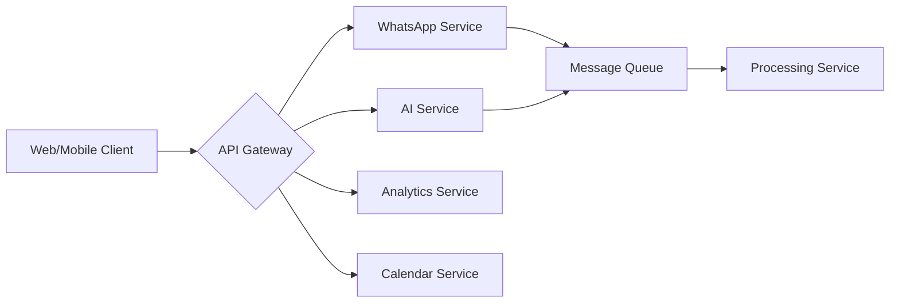

# Product Requirements Document (PRD)

# 1. INTRODUCTION

## 1.1 Purpose

This Product Requirements Document (PRD) specifies the requirements for Porfin, an AI-powered business management platform for healthcare professionals in Brazil. The document serves as a comprehensive guide for the development team, stakeholders, and project managers involved in the implementation of the system. It details functional and non-functional requirements, system architecture, and implementation priorities.

## 1.2 Scope

### 1.2.1 Product Overview
Porfin is a SaaS platform that enables healthcare professionals to optimize their customer journeys and automate business processes through AI integration. The system primarily focuses on WhatsApp communication management, automated customer interactions, and business analytics.

### 1.2.2 Core Functionalities
- WhatsApp Business integration and management
- AI-powered virtual assistants for lead conversion and sales
- Real-time chat interface with AI intervention capabilities
- Business metrics monitoring and analysis
- Automated campaign management
- Customer journey tracking
- Calendar and appointment management

### 1.2.3 Key Benefits
- Improved customer conversion rates
- Automated customer communication
- Enhanced business intelligence
- Streamlined appointment scheduling
- Optimized sales processes
- Data-driven decision making
- Reduced operational overhead

### 1.2.4 Technical Boundaries
The system will be implemented using:
- Frontend: NextJS with TailwindCSS
- Backend: Python FastAPI
- Database: Firebase/Firestore
- Cloud Infrastructure: Google Cloud
- Key Integrations: WhatsApp Business API, OpenAI GPT-4, Google Calendar

### 1.2.5 User Base
- Healthcare professionals in Brazil
- Clinic administrators
- Medical secretaries
- Practice managers

# 2. PRODUCT DESCRIPTION

## 2.1 Product Perspective
Porfin operates as a standalone SaaS platform while integrating with several external systems:

- WhatsApp Business API/Baileys for message handling
- OpenAI GPT-4 for AI-powered conversations
- Google Cloud infrastructure for hosting and scalability
- Firebase/Firestore for data persistence
- Google Calendar for appointment management
- Payment gateways for Brazilian payment processing
- Future integrations with dental CRM systems (Clinicorp, EasyDental)

## 2.2 Product Functions
The primary functions include:

1. WhatsApp Communication Management
   - Real-time chat interface
   - Multi-account support
   - Message history tracking
   - AI intervention toggling

2. AI Virtual Assistants
   - Lead conversion assistant
   - Sales negotiation assistant
   - Customizable knowledge bases
   - Testing environment

3. Campaign Management
   - Template-based messaging
   - Automated scheduling
   - Target group selection
   - Performance tracking

4. Business Analytics
   - Sales funnel visualization
   - Conversion metrics
   - Response time analysis
   - AI-powered recommendations

5. Appointment Management
   - Calendar integration
   - Automated scheduling
   - Availability tracking

## 2.3 User Characteristics

### Primary Users
1. Healthcare Professionals
   - Expertise: Medical/dental domain knowledge
   - Technical proficiency: Basic to intermediate
   - Goals: Practice growth and automation

2. Clinic Administrators
   - Expertise: Business management
   - Technical proficiency: Intermediate
   - Goals: Operational efficiency

3. Medical Secretaries
   - Expertise: Customer service
   - Technical proficiency: Basic
   - Goals: Patient communication management

## 2.4 Constraints

### Technical Constraints
- WhatsApp Business API limitations
- Real-time messaging performance requirements
- Brazilian Portuguese language support
- Mobile device compatibility requirements

### Business Constraints
- Subscription model limited to R$1 per unique customer
- Initial R$20 credit limitation
- Brazilian market-specific requirements
- Healthcare industry regulations

### Security Constraints
- GDPR compliance requirements
- Healthcare data protection standards
- Authentication security requirements
- Message encryption requirements

## 2.5 Assumptions and Dependencies

### Assumptions
1. Users have:
   - Stable internet connection
   - WhatsApp Business account
   - Basic technical literacy
   - Brazilian Portuguese proficiency

2. System:
   - Operates 24/7
   - Handles concurrent users
   - Maintains 99.9% uptime
   - Processes messages in real-time

### Dependencies
1. External Services:
   - WhatsApp Business API availability
   - OpenAI GPT-4 service stability
   - Google Cloud infrastructure
   - Payment gateway services

2. Third-party Integrations:
   - Google Calendar API
   - Firebase services
   - Brazilian payment systems
   - Future CRM system APIs

# 3. PROCESS FLOWCHART

```mermaid
flowchart TB
    subgraph Virtual Assistant Setup
        A[Create Assistant] --> B[Select Type]
        B --> C[Configure Settings]
        C --> D[Upload Knowledge Base]
        D --> E[Test Environment]
        E --> F{Performance OK?}
        F -->|Yes| G[Deploy Assistant]
        F -->|No| C
    end

    subgraph WhatsApp Integration
        H[Connect WhatsApp] --> I[Validate Connection]
        I --> J[Initialize Baileys/API]
        J --> K[Start Message Handling]
    end

    subgraph Message Processing
        L[Incoming Message] --> M[Check AI Toggle]
        M -->|AI On| N[Process with Assistant]
        M -->|AI Off| O[Human Interface]
        N --> P[Generate Response]
        P --> Q[Delivery Check]
        Q -->|Approved| R[Send Response]
        Q -->|Rejected| O
    end
```

# 4. FUNCTIONAL REQUIREMENTS

## 4.1 Authentication & User Management

### ID: F001
**Description**: User registration and authentication system  
**Priority**: High

| Requirement ID | Requirement Description | Acceptance Criteria |
|---------------|------------------------|-------------------|
| F001.1 | Users must be able to register using email and password | - Valid email format verification - Password strength requirements - Clinic name required |
| F001.2 | Users must be able to sign in with Google | - OAuth 2.0 integration - Google account linking |
| F001.3 | Role-based access control | - Admin, secretary, and manager roles - Feature access based on roles |

## 4.2 WhatsApp Integration

### ID: F002
**Description**: WhatsApp Business connection and management  
**Priority**: High

| Requirement ID | Requirement Description | Acceptance Criteria |
|---------------|------------------------|-------------------|
| F002.1 | Connect multiple WhatsApp Business accounts | - Baileys integration - Multiple account management - Connection status monitoring |
| F002.2 | Connect WhatsApp Business API accounts | - Official API integration - API credentials management |
| F002.3 | Real-time message synchronization | - Bidirectional sync - Message status tracking |

## 4.3 Chat Interface

### ID: F003
**Description**: WhatsApp-like chat interface  
**Priority**: High

| Requirement ID | Requirement Description | Acceptance Criteria |
|---------------|------------------------|-------------------|
| F003.1 | Real-time chat display | - Message threading - Media support - Delivery status |
| F003.2 | AI intervention toggle | - Per-chat AI control - Visual AI status indicator |
| F003.3 | Chat history access | - Searchable history - Filter by date/status |

## 4.4 Business Analytics

### ID: F004
**Description**: Metrics monitoring and analysis  
**Priority**: High

| Requirement ID | Requirement Description | Acceptance Criteria |
|---------------|------------------------|-------------------|
| F004.1 | Key metrics dashboard | - Chat count - Response rates - Appointment rates - Response times |
| F004.2 | Sales funnel visualization | - Lead tracking - Stage transitions - Conversion rates |
| F004.3 | AI-powered analysis | - Trend analysis - Actionable recommendations |

## 4.5 Virtual Assistants

### ID: F005
**Description**: AI-powered virtual assistants  
**Priority**: High

| Requirement ID | Requirement Description | Acceptance Criteria |
|---------------|------------------------|-------------------|
| F005.1 | Lead conversion assistant | - Appointment scheduling - Secretary notification - Lead qualification |
| F005.2 | Sales negotiation assistant | - Price discussion - Payment processing - Treatment plan explanation |
| F005.3 | Assistant customization | - Name configuration - Prompt editing - Knowledge base management |

## 4.6 Campaign Management

### ID: F006
**Description**: WhatsApp campaign creation and management  
**Priority**: High

| Requirement ID | Requirement Description | Acceptance Criteria |
|---------------|------------------------|-------------------|
| F006.1 | Campaign creation | - Ad-hoc campaigns - Recurring campaigns - Template management |
| F006.2 | Target group selection | - Funnel stage filtering - Custom group creation |
| F006.3 | Campaign testing | - Test number support - Preview functionality - Configuration review |

## 4.7 Calendar Integration

### ID: F007
**Description**: Google Calendar integration  
**Priority**: Medium

| Requirement ID | Requirement Description | Acceptance Criteria |
|---------------|------------------------|-------------------|
| F007.1 | Appointment booking | - Available slot detection - Duration setting - Professional assignment |
| F007.2 | Calendar sync | - Real-time availability - Multiple calendar support |
| F007.3 | Appointment management | - Rescheduling - Cancellation handling |

## 4.8 CRM Integration

### ID: F008
**Description**: Integration with dental practice management systems  
**Priority**: Low

| Requirement ID | Requirement Description | Acceptance Criteria |
|---------------|------------------------|-------------------|
| F008.1 | Clinicorp integration | - Patient data sync - Appointment sync - Treatment history access |
| F008.2 | EasyDental integration | - Patient records sync - Treatment plan sync |
| F008.3 | Generic CRM integration | - RD Station support - HubSpot support |

# 5. NON-FUNCTIONAL REQUIREMENTS

## 5.1 Performance Requirements

| Category | Requirement | Target Metric |
|----------|------------|---------------|
| Response Time | Chat message processing | < 500ms |
| Response Time | AI response generation | < 3 seconds |
| Response Time | Dashboard loading | < 2 seconds |
| Throughput | Concurrent users per instance | 1000 users |
| Throughput | Messages processed per second | 100/second |
| Resource Usage | CPU utilization | < 70% average |
| Resource Usage | Memory usage | < 2GB per instance |
| Resource Usage | Storage growth | < 1GB per 1000 users/month |

## 5.2 Safety Requirements

| Category | Requirement | Implementation |
|----------|------------|----------------|
| Data Backup | Regular automated backups | Daily incremental, weekly full |
| Redundancy | System redundancy | Multi-zone deployment |
| Failure Recovery | Automatic failover | < 5 minutes recovery time |
| Data Loss Prevention | Message persistence | Zero message loss guarantee |
| Error Handling | Graceful degradation | Fallback to manual mode |
| System Monitoring | Health checks | 1-minute intervals |

## 5.3 Security Requirements

| Category | Requirement | Implementation |
|----------|------------|----------------|
| Authentication | Multi-factor authentication | Google OAuth 2.0 + password |
| Authorization | Role-based access control | Admin, Manager, Secretary roles |
| Data Encryption | In-transit encryption | TLS 1.3 |
| Data Encryption | At-rest encryption | AES-256 |
| API Security | Rate limiting | 100 requests/minute per user |
| Session Management | Session timeout | 24 hours |
| Audit Logging | Security events tracking | All access attempts logged |

## 5.4 Quality Requirements

### 5.4.1 Availability
- System uptime: 99.9%
- Planned maintenance: < 4 hours/month
- Unplanned downtime: < 1 hour/month

### 5.4.2 Maintainability
- Code coverage: > 80%
- Documentation: Comprehensive API docs
- Deployment time: < 30 minutes
- Rollback capability: < 15 minutes

### 5.4.3 Usability
- Learning curve: < 2 hours for basic functions
- Error messages: Clear, actionable Portuguese text
- Mobile responsiveness: All core functions
- Accessibility: WCAG 2.1 Level AA

### 5.4.4 Scalability
- Horizontal scaling: Auto-scaling up to 100k users
- Database scaling: Automatic sharding
- Storage scaling: Automatic expansion
- Load balancing: Round-robin with health checks

### 5.4.5 Reliability
- Mean Time Between Failures: > 720 hours
- Mean Time To Recovery: < 30 minutes
- Error rate: < 0.1% of all requests
- Data durability: 99.999999999%

## 5.5 Compliance Requirements

| Requirement | Standard/Regulation | Implementation |
|-------------|-------------------|----------------|
| Data Privacy | LGPD (Brazilian General Data Protection Law) | Full compliance |
| Healthcare Data | CFM Resolution No. 1.821/07 | Medical data handling |
| Security Standards | ISO 27001 | Security controls |
| Cloud Security | SOC 2 Type II | Google Cloud compliance |
| Accessibility | eMAG | Brazilian government standards |
| Payment Processing | PCI DSS | Payment data handling |

# 6. DATA REQUIREMENTS

## 6.1 Data Models

### 6.1.1 Core Entities

| Entity | Attributes | Description |
|--------|------------|-------------|
| User | id, email, clinic_name, role, created_at | Healthcare professional account |
| WhatsAppAccount | id, phone_number, type, connection_status | Connected WhatsApp accounts |
| Customer | id, phone, name, funnel_stage, first_contact | Patient/lead information |
| Chat | id, customer_id, wa_account_id, ai_enabled | WhatsApp conversation thread |
| Message | id, chat_id, content, direction, type, status | Individual message in chat |
| Campaign | id, name, type, status, target_group, schedule | Marketing campaign configuration |
| VirtualAssistant | id, name, type, prompt, status | AI assistant configuration |

## 6.2 Data Storage

### 6.2.1 Primary Storage
- Firestore NoSQL database for real-time data
- Collections sharded by user_id for scalability
- Automatic indexing on frequently queried fields

### 6.2.2 Data Retention
| Data Type | Retention Period | Storage Type |
|-----------|-----------------|--------------|
| Messages | 12 months | Hot storage |
| Chat History | 24 months | Warm storage |
| Metrics | 36 months | Cold storage |
| Campaign Data | 12 months | Warm storage |
| System Logs | 6 months | Cold storage |

### 6.2.3 Backup Strategy
- Daily incremental backups to Google Cloud Storage
- Weekly full backups with point-in-time recovery
- Cross-region replication for disaster recovery
- 30-day backup retention policy

## 6.3 Data Processing

### 6.3.1 Security Measures
- End-to-end encryption for message content
- Field-level encryption for sensitive data
- Role-based access control (RBAC)
- Data anonymization for analytics

### 6.3.2 Data Transformation
| Stage | Process | Tools |
|-------|---------|-------|
| Ingestion | Message normalization | FastAPI endpoints |
| Processing | Entity extraction | GPT-4 |
| Enrichment | Customer profiling | Custom ML models |
| Analytics | Metrics aggregation | BigQuery |

### 6.3.3 Real-time Processing
- WebSocket connections for live chat
- Message queuing for campaign delivery
- In-memory caching for frequent queries
- Event-driven architecture for notifications

# 7. EXTERNAL INTERFACES

## 7.1 User Interfaces

### 7.1.1 Web Application Interface

| Component | Description | Requirements |
|-----------|-------------|--------------|
| Dashboard | Main control center | - Responsive design with TailwindCSS - Dark/light mode support - Mobile-first approach |
| Chat Interface | WhatsApp-like messaging | - Real-time message updates - Media preview support - Typing indicators |
| Analytics Panel | Metrics visualization | - Interactive charts - Exportable reports - Customizable date ranges |
| Campaign Manager | Campaign creation/management | - Drag-drop template builder - Preview functionality - Status indicators |

### 7.1.2 Mobile Interface

| Component | Description | Requirements |
|-----------|-------------|--------------|
| Chat View | Mobile chat interface | - Native-like scrolling - Push notifications - Offline support |
| Calendar | Appointment management | - Touch-optimized interface - Quick actions - Sync indicators |

## 7.2 Hardware Interfaces

### 7.2.1 Mobile Devices

| Interface | Specification | Implementation |
|-----------|--------------|----------------|
| Camera | Photo/document capture | - React Native camera API - Image compression |
| Microphone | Voice message recording | - Web Audio API - Opus codec support |
| Storage | Local data caching | - IndexedDB for web - SQLite for mobile |

## 7.3 Software Interfaces

### 7.3.1 External Services

| Service | Interface Type | Requirements |
|---------|---------------|--------------|
| WhatsApp Business | REST/WebSocket | - Baileys integration - Official API support - Message queuing |
| OpenAI GPT-4 | REST API | - Streaming responses - Error handling - Rate limiting |
| Google Calendar | REST API | - OAuth 2.0 authentication - Event synchronization |
| Firebase/Firestore | SDK | - Real-time updates - Offline persistence |

### 7.3.2 CRM Integrations

| System | Interface Type | Data Exchange |
|--------|---------------|---------------|
| Clinicorp | REST API | - Patient records - Appointment data - Treatment plans |
| EasyDental | REST API | - Patient history - Treatment status |
| RD Station | REST API | - Lead data - Campaign metrics |

## 7.4 Communication Interfaces

### 7.4.1 Network Protocols

| Protocol | Usage | Requirements |
|----------|-------|--------------|
| HTTPS | API communication | - TLS 1.3 - Certificate management |
| WebSocket | Real-time messaging | - Secure WebSocket (WSS) - Auto-reconnection |
| gRPC | Internal services | - Protocol buffers - Service discovery |

### 7.4.2 Data Formats

| Format | Usage | Specification |
|--------|-------|--------------|
| JSON | API responses | - UTF-8 encoding - Schema validation |
| Protocol Buffers | Internal communication | - Version control - Backward compatibility |
| MessagePack | Real-time data | - Binary serialization - Compression |

### 7.4.3 Integration Endpoints

# 8. APPENDICES

## 8.1 GLOSSARY

| Term | Definition |
|------|------------|
| Porfin | AI-powered business management platform for healthcare professionals in Brazil |
| Virtual Assistant | AI-powered agent that handles specific business functions like lead conversion or sales |
| Baileys | Open-source library for WhatsApp Web API integration |
| PIX | Brazilian instant payment system |
| Knowledge Base | Collection of documents and information used to train virtual assistants |
| Sales Funnel | Customer journey stages from lead to post-treatment |
| Campaign | Automated series of WhatsApp messages sent to targeted customer groups |
| Jinja Template | Text template system supporting variable substitution for message customization |

## 8.2 ACRONYMS

| Acronym | Full Form |
|---------|-----------|
| API | Application Programming Interface |
| CRM | Customer Relationship Management |
| GDPR | General Data Protection Regulation |
| LGPD | Lei Geral de Proteção de Dados (Brazilian General Data Protection Law) |
| LLM | Large Language Model |
| NLU | Natural Language Understanding |
| PRD | Product Requirements Document |
| RBAC | Role-Based Access Control |
| SaaS | Software as a Service |
| TLS | Transport Layer Security |
| WSS | WebSocket Secure |

## 8.3 ADDITIONAL REFERENCES

### 8.3.1 Technical Resources

| Resource | URL | Purpose |
|----------|-----|----------|
| Baileys Documentation | https://github.com/WhiskeySockets/Baileys | WhatsApp integration reference |
| NextJS Documentation | https://nextjs.org/docs | Frontend framework reference |
| FastAPI Documentation | https://fastapi.tiangolo.com | Backend framework reference |
| Firebase Documentation | https://firebase.google.com/docs | Authentication and database reference |
| WhatsApp Business API | https://developers.facebook.com/docs/whatsapp | Official API documentation |

### 8.3.2 Healthcare Regulations

| Resource | Description |
|----------|-------------|
| CFM Resolution No. 1.821/07 | Brazilian medical data handling guidelines |
| eMAG | Brazilian government accessibility standards |
| LGPD Healthcare Guidelines | Specific data protection requirements for healthcare sector |

### 8.3.3 Integration Partners

| Partner | Integration Purpose |
|---------|-------------------|
| Clinicorp | Dental practice management system |
| EasyDental | Dental clinic software |
| RD Station | Marketing automation platform |
| HubSpot | CRM platform |
| Google Calendar | Appointment scheduling |

## 8.4 REVISION HISTORY

| Version | Date | Author | Changes |
|---------|------|--------|---------|
| 1.0 | Initial | - | Initial document creation |