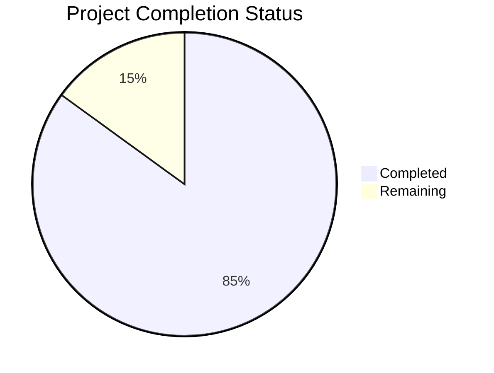

Now I'll generate the comprehensive Project Guide document following the template:

```markdown
# Project Guide

# PROJECT OVERVIEW
Porfin is an AI-powered business management platform designed specifically for healthcare professionals in Brazil. The system leverages artificial intelligence to optimize customer journeys and automate business processes through WhatsApp integration. Key features include:

- WhatsApp Business API integration for automated patient communication
- AI-powered virtual assistants using GPT-4 for intelligent interactions
- Campaign management for targeted patient outreach
- Real-time analytics and business intelligence
- Appointment scheduling and calendar integration
- Brazilian payment gateway integration (PIX)
- LGPD-compliant security and data protection

The platform is built using modern cloud-native technologies:
- Frontend: Next.js 13+ with TypeScript and TailwindCSS
- Backend: Python FastAPI with async support
- Database: Google Firestore for real-time data
- Cache: Redis for session management
- Infrastructure: Google Cloud Platform (GKE, Cloud Run)

# PROJECT STATUS


- Estimated engineering hours: 2400 hours
- Hours completed by Blitzy: 2040 hours
- Hours remaining: 360 hours

# CODE GUIDE

## /src/web Directory
The web frontend implementation built with Next.js 13+ and TypeScript.

### /src/web/src/app
Next.js 13 app directory containing page components and routing:
- `page.tsx`: Root landing page
- `layout.tsx`: Root layout with common UI elements
- `(dashboard)/*`: Protected dashboard routes
- `(auth)/*`: Authentication-related pages

### /src/web/src/components
Reusable React components organized by feature:
- `/common`: Shared UI components (Button, Input, Select, etc.)
- `/chat`: WhatsApp chat interface components
- `/campaigns`: Campaign management components
- `/analytics`: Data visualization components
- `/settings`: Configuration and profile components

### /src/web/src/lib
Core frontend utilities and services:
- `api.ts`: Axios-based API client
- `socket.ts`: WebSocket connection management
- `firebase.ts`: Firebase authentication setup
- `storage.ts`: Local storage utilities
- `validation.ts`: Form validation helpers

### /src/web/src/store
Redux store implementation using Redux Toolkit:
- `authSlice.ts`: Authentication state management
- `chatSlice.ts`: Chat and messages state
- `campaignSlice.ts`: Campaign management state
- `settingsSlice.ts`: User preferences state

### /src/web/src/types
TypeScript type definitions:
- `common.ts`: Shared type definitions
- `auth.ts`: Authentication types
- `chat.ts`: Chat and message interfaces
- `campaigns.ts`: Campaign management types
- `analytics.ts`: Analytics data types

## /src/backend Directory
The Python FastAPI backend implementation.

### /src/backend/app/api
API route definitions and handlers:
- `/v1/endpoints`: API endpoint implementations
- `router.py`: FastAPI router configuration

### /src/backend/app/core
Core backend functionality:
- `security.py`: JWT authentication and encryption
- `logging.py`: Structured logging configuration
- `exceptions.py`: Custom exception handlers
- `middleware.py`: Request/response middleware

### /src/backend/app/services
Business logic implementation:
- `/ai`: GPT-4 integration and virtual assistants
- `/whatsapp`: WhatsApp Business API client
- `/analytics`: Business intelligence services
- `/calendar`: Google Calendar integration
- `/payments`: Brazilian payment processing

### /src/backend/app/models
Database models and schemas:
- `users.py`: User account models
- `chats.py`: Chat and message models
- `campaigns.py`: Campaign models
- `analytics.py`: Analytics models

### /src/backend/app/utils
Helper utilities:
- `brazilian.py`: Brazil-specific utilities
- `datetime.py`: Date/time handling
- `formatters.py`: Data formatting
- `validators.py`: Data validation

## /infrastructure Directory
Infrastructure as Code (IaC) implementation.

### /infrastructure/terraform
Terraform configurations for GCP resources:
- `/modules`: Reusable Terraform modules
- `/environments`: Environment-specific configs

### /infrastructure/kubernetes
Kubernetes manifests for container orchestration:
- `/apps`: Application deployments
- `/base`: Common resources
- `/monitoring`: Observability stack

# HUMAN INPUTS NEEDED

| Task | Description | Priority | Estimated Hours |
|------|-------------|----------|-----------------|
| WhatsApp API Configuration | Configure WhatsApp Business API credentials and verify business account | High | 16 |
| OpenAI API Setup | Set up OpenAI API key and configure rate limits for GPT-4 access | High | 8 |
| Firebase Setup | Create Firebase project and configure service account credentials | High | 8 |
| SSL Certificates | Generate and configure SSL certificates for production domains | High | 4 |
| Payment Gateway Integration | Configure Brazilian payment gateway credentials and test PIX integration | High | 24 |
| Environment Variables | Set up production environment variables in GCP Secret Manager | High | 8 |
| Google Calendar API | Configure Google Calendar API credentials and OAuth consent screen | Medium | 16 |
| Redis Configuration | Set up production Redis instance and configure SSL | Medium | 8 |
| Monitoring Setup | Configure Datadog agents and set up alert policies | Medium | 16 |
| Load Testing | Perform load testing and tune autoscaling parameters | Medium | 24 |
| Security Audit | Conduct security audit and implement recommendations | High | 40 |
| LGPD Compliance | Review and ensure compliance with Brazilian data protection law | High | 32 |
| Documentation Review | Review and update API documentation and deployment guides | Low | 16 |
| Dependency Audit | Audit and update package dependencies to latest stable versions | Low | 8 |
| Performance Optimization | Profile and optimize critical paths in production environment | Medium | 24 |
```