# Technical Specifications

# 1. INTRODUCTION

## 1.1 Executive Summary

Porfin is an AI-powered business management platform designed specifically for healthcare professionals in Brazil. The system leverages artificial intelligence to optimize customer journeys and automate business processes through WhatsApp integration, enabling healthcare providers to convert more leads, improve patient communication, and grow their practices efficiently. By combining WhatsApp Business integration, AI-powered virtual assistants, and comprehensive analytics, Porfin addresses the critical challenge of managing patient communications and sales processes in Brazilian healthcare practices.

Primary stakeholders include healthcare professionals, clinic administrators, and medical secretaries who will benefit from automated patient interactions, streamlined appointment scheduling, and data-driven business insights, ultimately leading to increased practice revenue and improved operational efficiency.

## 1.2 System Overview

### Project Context

| Aspect | Description |
|--------|-------------|
| Market Position | First-to-market AI-powered practice management solution focused on WhatsApp automation for Brazilian healthcare providers |
| Current Limitations | Manual WhatsApp communication, inefficient lead conversion, lack of analytics |
| Enterprise Integration | Seamless integration with existing dental practice management systems and CRM platforms |

### High-Level Description

| Component | Implementation |
|-----------|----------------|
| Frontend | NextJS with TailwindCSS, responsive design |
| Backend | Python FastAPI, Firebase authentication |
| Database | Firestore for real-time messaging |
| AI Integration | OpenAI GPT-4 for virtual assistants |
| Core Integration | WhatsApp Business API/Baileys |
| Infrastructure | Google Cloud Platform |

### Success Criteria

| KPI Category | Target Metrics |
|--------------|----------------|
| User Adoption | 1000+ healthcare providers in first year |
| Message Processing | 100+ messages/second with <500ms latency |
| System Uptime | 99.9% availability |
| Business Impact | 30% increase in lead conversion rates |

## 1.3 Scope

### In-Scope Elements

| Category | Components |
|----------|------------|
| Core Features | - WhatsApp Business integration<br>- AI virtual assistants<br>- Campaign management<br>- Business analytics<br>- Appointment scheduling |
| User Groups | - Healthcare professionals<br>- Clinic administrators<br>- Medical secretaries |
| Geographic Coverage | Brazil (Portuguese language) |
| Data Domains | - Patient communications<br>- Appointment data<br>- Sales/lead information<br>- Campaign metrics |

### Implementation Boundaries

| Boundary Type | Specification |
|--------------|---------------|
| Technical | - Web-based platform<br>- Mobile-responsive design<br>- Cloud-native architecture |
| Integration | - WhatsApp Business API<br>- Google Calendar<br>- Payment gateways<br>- CRM systems |
| Security | - LGPD compliance<br>- Healthcare data protection<br>- End-to-end encryption |

### Out-of-Scope Elements

| Category | Excluded Items |
|----------|----------------|
| Features | - Electronic Health Records (EHR)<br>- Medical imaging<br>- Billing/accounting systems<br>- Inventory management |
| Languages | Non-Portuguese languages |
| Platforms | Native mobile applications |
| Integrations | - Legacy practice management systems<br>- Non-Brazilian payment systems<br>- Social media platforms besides WhatsApp |

# 2. SYSTEM ARCHITECTURE

## 2.1 High-Level Architecture

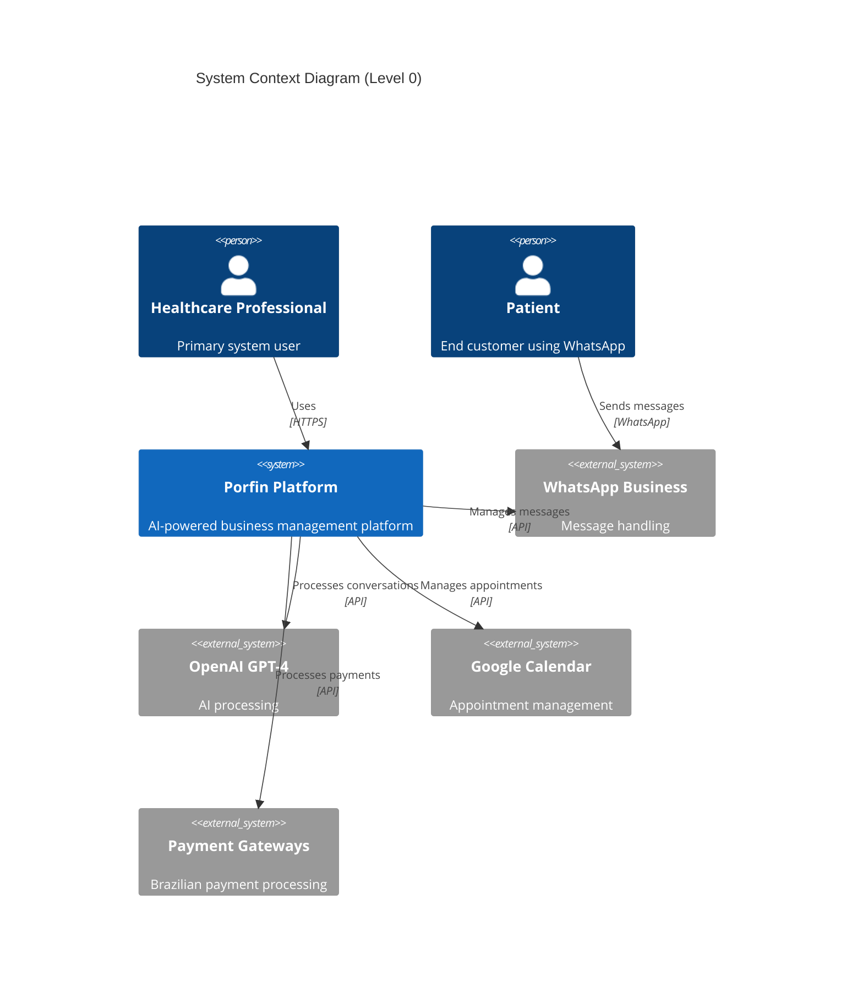
```mermaid
C4Context
    title System Context Diagram (Level 0)
    
    Person(healthcarePro, "Healthcare Professional", "Primary system user")
    Person(patient, "Patient", "End customer using WhatsApp")
    
    System(porfin, "Porfin Platform", "AI-powered business management platform")
    
    System_Ext(whatsapp, "WhatsApp Business", "Message handling")
    System_Ext(openai, "OpenAI GPT-4", "AI processing")
    System_Ext(calendar, "Google Calendar", "Appointment management")
    System_Ext(payment, "Payment Gateways", "Brazilian payment processing")
    
    Rel(healthcarePro, porfin, "Uses", "HTTPS")
    Rel(patient, whatsapp, "Sends messages", "WhatsApp")
    Rel(porfin, whatsapp, "Manages messages", "API")
    Rel(porfin, openai, "Processes conversations", "API")
    Rel(porfin, calendar, "Manages appointments", "API")
    Rel(porfin, payment, "Processes payments", "API")
```

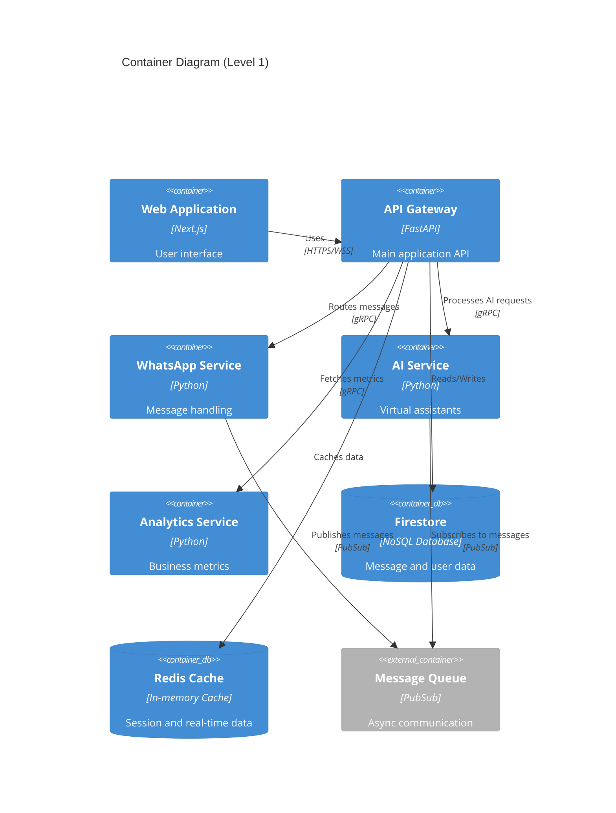
```mermaid
C4Container
    title Container Diagram (Level 1)
    
    Container(webapp, "Web Application", "Next.js", "User interface")
    Container(api, "API Gateway", "FastAPI", "Main application API")
    Container(whatsappService, "WhatsApp Service", "Python", "Message handling")
    Container(aiService, "AI Service", "Python", "Virtual assistants")
    Container(analyticsService, "Analytics Service", "Python", "Business metrics")
    
    ContainerDb(firestore, "Firestore", "NoSQL Database", "Message and user data")
    ContainerDb(cache, "Redis Cache", "In-memory Cache", "Session and real-time data")
    
    Container_Ext(queue, "Message Queue", "PubSub", "Async communication")
    
    Rel(webapp, api, "Uses", "HTTPS/WSS")
    Rel(api, whatsappService, "Routes messages", "gRPC")
    Rel(api, aiService, "Processes AI requests", "gRPC")
    Rel(api, analyticsService, "Fetches metrics", "gRPC")
    
    Rel(whatsappService, queue, "Publishes messages", "PubSub")
    Rel(aiService, queue, "Subscribes to messages", "PubSub")
    
    Rel_R(api, firestore, "Reads/Writes")
    Rel_R(api, cache, "Caches data")
```

## 2.2 Component Details

### 2.2.1 Core Components

| Component | Purpose | Technology Stack | Scaling Strategy |
|-----------|---------|-----------------|------------------|
| Web Application | User interface | - Next.js<br>- TailwindCSS<br>- Framer Motion | - Static site generation<br>- CDN distribution<br>- Container-based scaling |
| API Gateway | Request routing | - FastAPI<br>- Pydantic<br>- OAuth2 | - Horizontal scaling<br>- Load balancing<br>- Rate limiting |
| WhatsApp Service | Message handling | - Baileys/Official API<br>- WebSocket<br>- Protocol Buffers | - Instance per account<br>- Connection pooling |
| AI Service | Virtual assistants | - OpenAI SDK<br>- Custom ML models<br>- Vector DB | - Queue-based processing<br>- Auto-scaling |
| Analytics Service | Business intelligence | - pandas<br>- NumPy<br>- BigQuery | - Batch processing<br>- Materialized views |

### 2.2.2 Data Storage Components

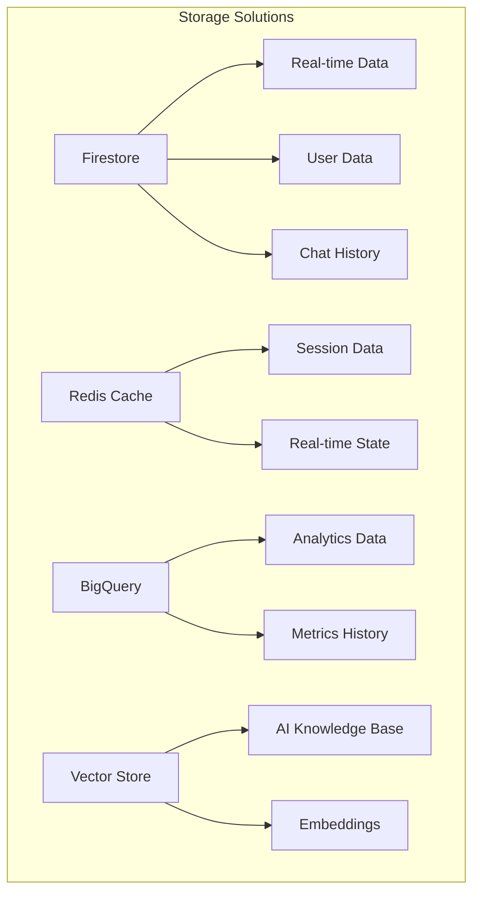
```mermaid
graph TB
    subgraph Storage Solutions
        A[Firestore] --> B[Real-time Data]
        A --> C[User Data]
        A --> D[Chat History]
        
        E[Redis Cache] --> F[Session Data]
        E --> G[Real-time State]
        
        H[BigQuery] --> I[Analytics Data]
        H --> J[Metrics History]
        
        K[Vector Store] --> L[AI Knowledge Base]
        K --> M[Embeddings]
    end
```

## 2.3 Technical Decisions

### 2.3.1 Architecture Patterns

| Pattern | Implementation | Justification |
|---------|----------------|---------------|
| Microservices | Domain-based services | - Independent scaling<br>- Technology flexibility<br>- Fault isolation |
| Event-driven | PubSub messaging | - Asynchronous processing<br>- Loose coupling<br>- Real-time updates |
| CQRS | Separate read/write paths | - Optimized queries<br>- Scalable writes<br>- Analytics support |

### 2.3.2 Communication Patterns

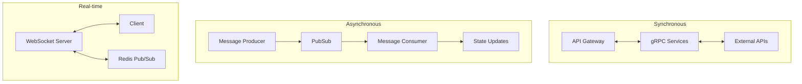
```mermaid
flowchart TB
    subgraph Synchronous
        A[API Gateway] <--> B[gRPC Services]
        B <--> C[External APIs]
    end
    
    subgraph Asynchronous
        D[Message Producer] --> E[PubSub]
        E --> F[Message Consumer]
        F --> G[State Updates]
    end
    
    subgraph Real-time
        H[WebSocket Server] <--> I[Client]
        H <--> J[Redis Pub/Sub]
    end
```

## 2.4 Cross-Cutting Concerns

### 2.4.1 Monitoring and Observability

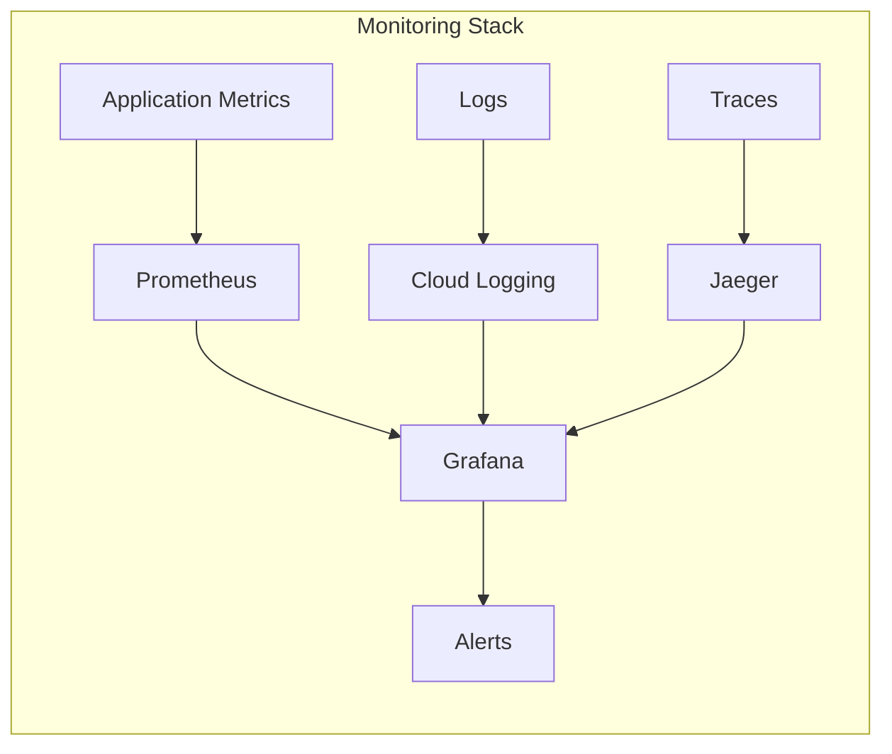
```mermaid
graph LR
    subgraph Monitoring Stack
        A[Application Metrics] --> B[Prometheus]
        C[Logs] --> D[Cloud Logging]
        E[Traces] --> F[Jaeger]
        
        B --> G[Grafana]
        D --> G
        F --> G
        
        G --> H[Alerts]
    end
```

### 2.4.2 Security Architecture

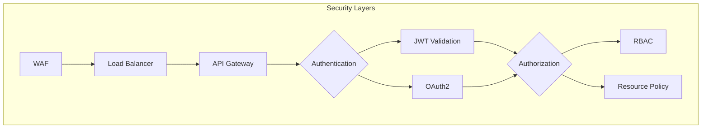
```mermaid
flowchart TB
    subgraph Security Layers
        A[WAF] --> B[Load Balancer]
        B --> C[API Gateway]
        
        C --> D{Authentication}
        D --> E[JWT Validation]
        D --> F[OAuth2]
        
        E --> G{Authorization}
        F --> G
        
        G --> H[RBAC]
        G --> I[Resource Policy]
    end
```

## 2.5 Deployment Architecture

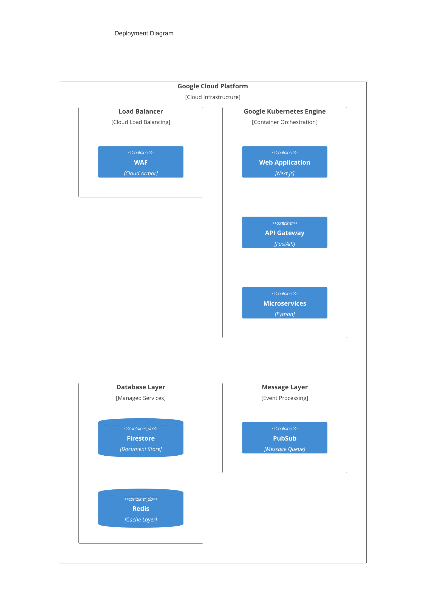
```mermaid
C4Deployment
    title Deployment Diagram
    
    Deployment_Node(gcp, "Google Cloud Platform", "Cloud Infrastructure") {
        Deployment_Node(lb, "Load Balancer", "Cloud Load Balancing") {
            Container(waf, "WAF", "Cloud Armor")
        }
        
        Deployment_Node(gke, "Google Kubernetes Engine", "Container Orchestration") {
            Container(webapp, "Web Application", "Next.js")
            Container(api, "API Gateway", "FastAPI")
            Container(services, "Microservices", "Python")
        }
        
        Deployment_Node(db, "Database Layer", "Managed Services") {
            ContainerDb(firestore, "Firestore", "Document Store")
            ContainerDb(redis, "Redis", "Cache Layer")
        }
        
        Deployment_Node(pubsub, "Message Layer", "Event Processing") {
            Container(queue, "PubSub", "Message Queue")
        }
    }
```

### 2.5.1 Infrastructure Requirements

| Component | Specifications | Scaling Limits |
|-----------|---------------|----------------|
| Load Balancer | - Global load balancing<br>- SSL termination<br>- DDoS protection | - 100k requests/second<br>- 1000 SSL connections/second |
| Kubernetes Cluster | - Multi-zone deployment<br>- Auto-scaling<br>- Resource quotas | - 100 nodes<br>- 1000 pods/node |
| Database | - Multi-region replication<br>- Point-in-time recovery<br>- Automatic sharding | - 10TB data<br>- 50k operations/second |
| Message Queue | - Ordered delivery<br>- At-least-once semantics<br>- Dead letter queues | - 1M messages/second<br>- 7 days retention |

# 3. SYSTEM COMPONENTS ARCHITECTURE

## 3.1 USER INTERFACE DESIGN

### 3.1.1 Design Specifications

| Category | Requirements | Implementation |
|----------|--------------|----------------|
| Visual Hierarchy | Material Design 3.0 principles | - 8px grid system<br>- Type scale: 1.2 ratio<br>- Z-index layers |
| Component Library | Radix UI + TailwindCSS | - Atomic design system<br>- Reusable primitives<br>- Custom healthcare components |
| Responsive Design | Mobile-first approach | - Breakpoints: 640px, 768px, 1024px, 1280px<br>- Fluid typography<br>- Container queries |
| Accessibility | WCAG 2.1 Level AA | - ARIA landmarks<br>- Keyboard navigation<br>- Screen reader support |
| Browser Support | Modern browsers | - Chrome 90+<br>- Firefox 88+<br>- Safari 14+<br>- Edge 90+ |
| Theme Support | Dark/Light modes | - CSS variables<br>- System preference detection<br>- Manual override |
| Localization | Brazilian Portuguese | - RTL support ready<br>- Date/number formatting<br>- Currency: BRL |

### 3.1.2 Interface Elements

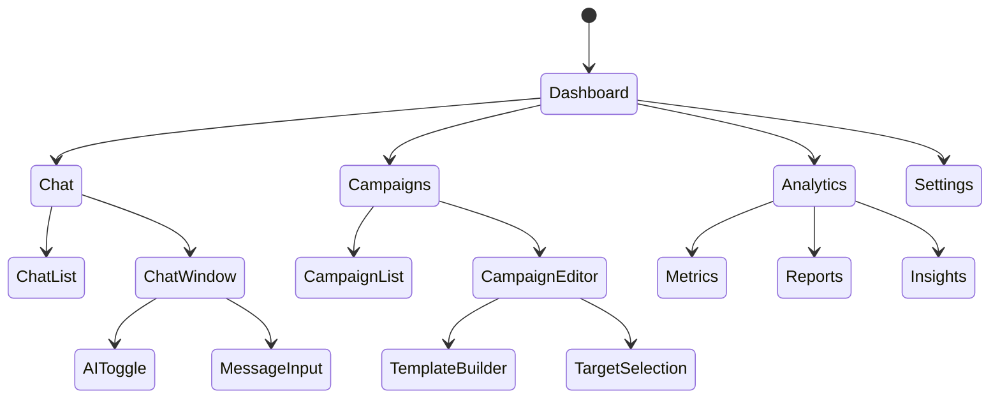
```mermaid
stateDiagram-v2
    [*] --> Dashboard
    Dashboard --> Chat
    Dashboard --> Analytics
    Dashboard --> Campaigns
    Dashboard --> Settings
    
    Chat --> ChatList
    Chat --> ChatWindow
    ChatWindow --> AIToggle
    ChatWindow --> MessageInput
    
    Campaigns --> CampaignList
    Campaigns --> CampaignEditor
    CampaignEditor --> TemplateBuilder
    CampaignEditor --> TargetSelection
    
    Analytics --> Metrics
    Analytics --> Reports
    Analytics --> Insights
```

### 3.1.3 Critical User Flows

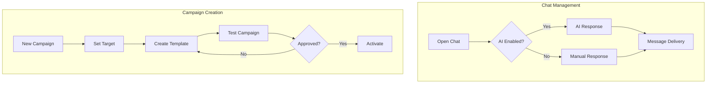
```mermaid
flowchart TB
    subgraph Chat Management
        A[Open Chat] --> B{AI Enabled?}
        B -->|Yes| C[AI Response]
        B -->|No| D[Manual Response]
        C --> E[Message Delivery]
        D --> E
    end
    
    subgraph Campaign Creation
        F[New Campaign] --> G[Set Target]
        G --> H[Create Template]
        H --> I[Test Campaign]
        I --> J{Approved?}
        J -->|Yes| K[Activate]
        J -->|No| H
    end
```

## 3.2 DATABASE DESIGN

### 3.2.1 Schema Design

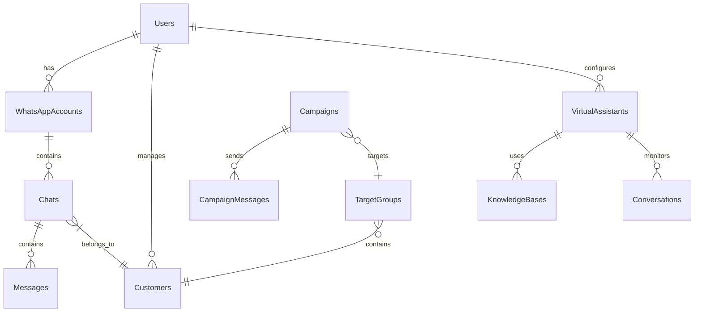
```mermaid
erDiagram
    Users ||--o{ WhatsAppAccounts : has
    Users ||--o{ Customers : manages
    Users ||--o{ VirtualAssistants : configures
    
    WhatsAppAccounts ||--o{ Chats : contains
    Chats ||--o{ Messages : contains
    Chats }|--|| Customers : belongs_to
    
    VirtualAssistants ||--o{ KnowledgeBases : uses
    VirtualAssistants ||--o{ Conversations : monitors
    
    Campaigns ||--o{ CampaignMessages : sends
    Campaigns }o--|| TargetGroups : targets
    TargetGroups }o--|| Customers : contains
```

### 3.2.2 Data Management

| Aspect | Strategy | Implementation |
|--------|----------|----------------|
| Migration | Progressive schema updates | - Firestore schema versioning<br>- Backward compatibility<br>- Blue-green deployments |
| Versioning | Semantic versioning | - Schema version tracking<br>- Migration scripts<br>- Rollback procedures |
| Archival | Time-based archival | - 12-month active retention<br>- Cold storage after 12 months<br>- Compliance preservation |
| Privacy | LGPD compliance | - Data encryption<br>- Access controls<br>- Data minimization |
| Audit | Comprehensive logging | - Write operations<br>- Access patterns<br>- System changes |

### 3.2.3 Performance Optimization

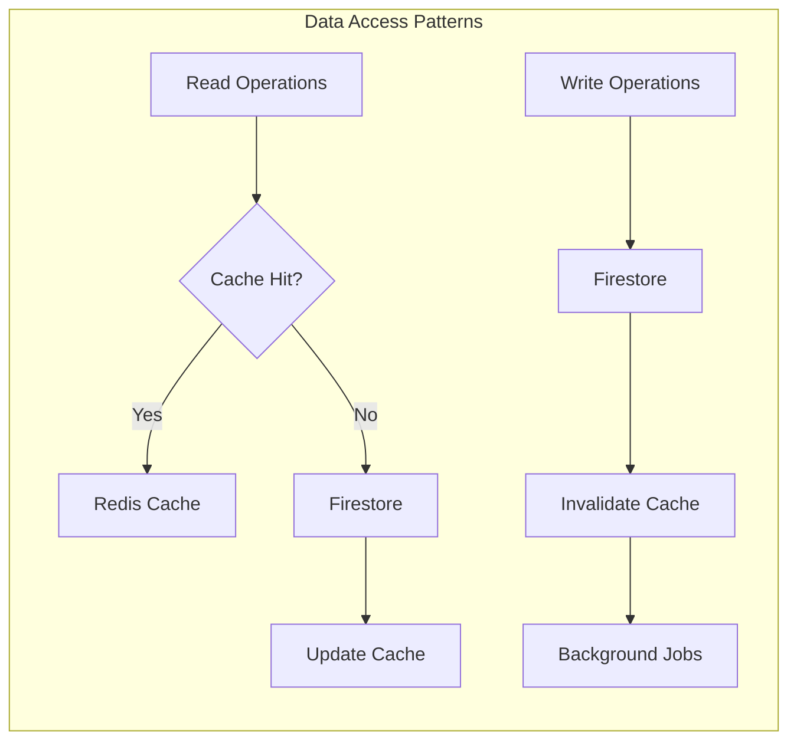
```mermaid
flowchart LR
    subgraph Data Access Patterns
        A[Read Operations] --> B{Cache Hit?}
        B -->|Yes| C[Redis Cache]
        B -->|No| D[Firestore]
        D --> E[Update Cache]
        
        F[Write Operations] --> G[Firestore]
        G --> H[Invalidate Cache]
        H --> I[Background Jobs]
    end
```

## 3.3 API DESIGN

### 3.3.1 API Architecture

| Component | Specification | Implementation |
|-----------|--------------|----------------|
| Protocol | REST + WebSocket | - HTTP/2<br>- WSS for real-time |
| Authentication | JWT + OAuth2 | - Token-based auth<br>- Refresh tokens |
| Authorization | RBAC | - Role-based policies<br>- Resource-level permissions |
| Rate Limiting | Token bucket | - 100 req/min per user<br>- Burst allowance |
| Versioning | URI versioning | - /v1/ prefix<br>- Deprecation headers |
| Documentation | OpenAPI 3.0 | - Swagger UI<br>- API documentation |

### 3.3.2 Interface Specifications

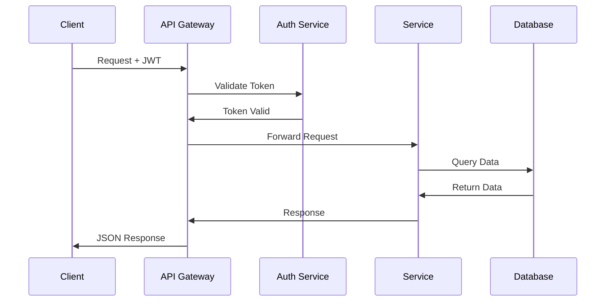
```mermaid
sequenceDiagram
    participant C as Client
    participant G as API Gateway
    participant A as Auth Service
    participant S as Service
    participant D as Database
    
    C->>G: Request + JWT
    G->>A: Validate Token
    A->>G: Token Valid
    G->>S: Forward Request
    S->>D: Query Data
    D->>S: Return Data
    S->>G: Response
    G->>C: JSON Response
```

### 3.3.3 Integration Requirements

| Integration | Type | Requirements |
|-------------|------|--------------|
| WhatsApp | REST + WebSocket | - Message queuing<br>- Retry logic<br>- Rate limiting |
| OpenAI | REST | - Streaming support<br>- Error handling<br>- Fallback logic |
| Calendar | REST | - OAuth flow<br>- Sync mechanism<br>- Conflict resolution |
| Payment | REST | - PCI compliance<br>- Idempotency<br>- Transaction logging |

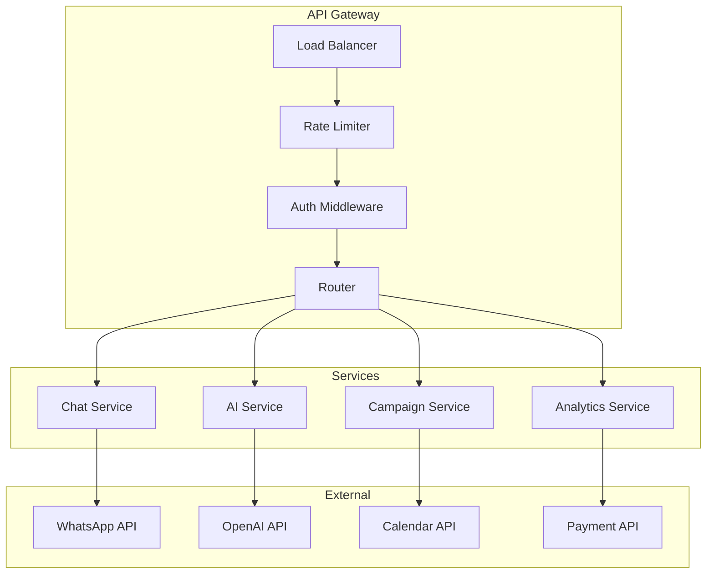
```mermaid
flowchart TB
    subgraph API Gateway
        A[Load Balancer] --> B[Rate Limiter]
        B --> C[Auth Middleware]
        C --> D[Router]
    end
    
    subgraph Services
        D --> E[Chat Service]
        D --> F[AI Service]
        D --> G[Campaign Service]
        D --> H[Analytics Service]
    end
    
    subgraph External
        E --> I[WhatsApp API]
        F --> J[OpenAI API]
        G --> K[Calendar API]
        H --> L[Payment API]
    end
```

# 4. TECHNOLOGY STACK

## 4.1 PROGRAMMING LANGUAGES

| Platform | Language | Version | Justification |
|----------|----------|---------|---------------|
| Backend | Python | 3.11+ | - Strong AI/ML ecosystem<br>- Extensive async support<br>- Rich library ecosystem for WhatsApp integration |
| Frontend | TypeScript | 5.0+ | - Type safety for large-scale application<br>- Enhanced developer experience<br>- Better integration with NextJS |
| Infrastructure | Go | 1.20+ | - High-performance microservices<br>- Efficient resource utilization<br>- Native cloud platform support |

## 4.2 FRAMEWORKS & LIBRARIES

### 4.2.1 Core Frameworks

| Component | Framework | Version | Justification |
|-----------|-----------|---------|---------------|
| Backend API | FastAPI | 0.100+ | - High performance async support<br>- Native OpenAPI documentation<br>- WebSocket support for real-time chat |
| Frontend Web | NextJS | 13+ | - Server-side rendering<br>- Built-in routing<br>- Optimized performance |
| UI Components | Radix UI | 1.0+ | - Accessible components<br>- Customizable with TailwindCSS<br>- Production-ready primitives |
| Styling | TailwindCSS | 3.3+ | - Utility-first approach<br>- Responsive design support<br>- Dark mode capabilities |

### 4.2.2 Supporting Libraries

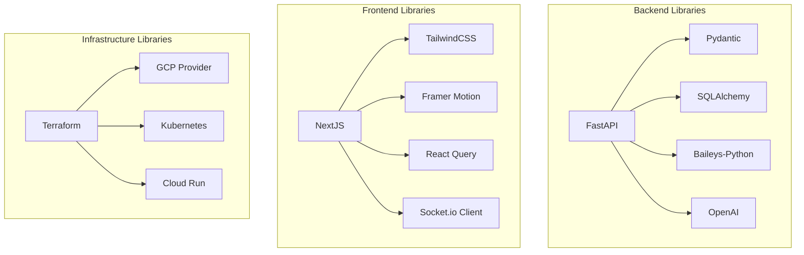
```mermaid
graph TB
    subgraph Backend Libraries
        A[FastAPI] --> B[Pydantic]
        A --> C[SQLAlchemy]
        A --> D[Baileys-Python]
        A --> E[OpenAI]
    end
    
    subgraph Frontend Libraries
        F[NextJS] --> G[TailwindCSS]
        F --> H[Framer Motion]
        F --> I[React Query]
        F --> J[Socket.io Client]
    end
    
    subgraph Infrastructure Libraries
        K[Terraform] --> L[GCP Provider]
        K --> M[Kubernetes]
        K --> N[Cloud Run]
    end
```

## 4.3 DATABASES & STORAGE

### 4.3.1 Primary Data Stores

| Type | Technology | Purpose | Justification |
|------|------------|---------|---------------|
| Document Store | Firestore | Real-time data | - Real-time sync capabilities<br>- Horizontal scaling<br>- Native Firebase integration |
| Cache | Redis | Session/Real-time | - In-memory performance<br>- Pub/Sub support<br>- Distributed caching |
| Analytics | BigQuery | Business metrics | - Large-scale analytics<br>- SQL interface<br>- Integration with GCP |
| Vector Store | Pinecone | AI embeddings | - Efficient similarity search<br>- Scalable vector operations<br>- Cloud-native architecture |

### 4.3.2 Storage Architecture

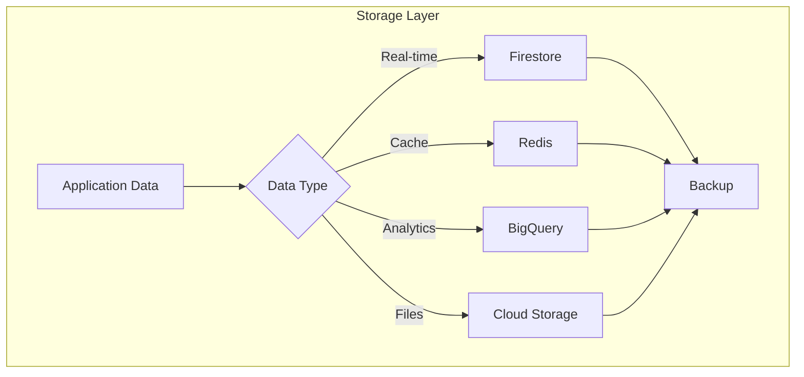
```mermaid
flowchart TB
    subgraph Storage Layer
        A[Application Data] --> B{Data Type}
        B -->|Real-time| C[Firestore]
        B -->|Cache| D[Redis]
        B -->|Analytics| E[BigQuery]
        B -->|Files| F[Cloud Storage]
        
        C --> G[Backup]
        D --> G
        E --> G
        F --> G
    end
```

## 4.4 THIRD-PARTY SERVICES

| Category | Service | Purpose | Integration Method |
|----------|---------|---------|-------------------|
| AI/ML | OpenAI GPT-4 | Virtual assistants | REST API with streaming |
| Messaging | WhatsApp Business | Customer communication | Baileys/Official API |
| Authentication | Firebase Auth | User management | SDK integration |
| Calendar | Google Calendar | Appointment management | REST API |
| Monitoring | Datadog | System monitoring | Agent-based |
| Payment | Brazilian Payment Gateways | Transaction processing | REST API |

## 4.5 DEVELOPMENT & DEPLOYMENT

### 4.5.1 Development Environment

| Tool | Purpose | Version |
|------|---------|---------|
| VS Code | IDE | Latest |
| Docker | Containerization | 24.0+ |
| pnpm | Package management | 8.0+ |
| Poetry | Python dependency management | 1.5+ |

### 4.5.2 Deployment Pipeline

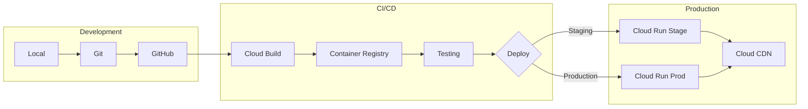
```mermaid
flowchart LR
    subgraph Development
        A[Local] --> B[Git]
        B --> C[GitHub]
    end
    
    subgraph CI/CD
        C --> D[Cloud Build]
        D --> E[Container Registry]
        E --> F[Testing]
        F --> G{Deploy}
    end
    
    subgraph Production
        G -->|Staging| H[Cloud Run Stage]
        G -->|Production| I[Cloud Run Prod]
        H --> J[Cloud CDN]
        I --> J
    end
```

### 4.5.3 Infrastructure Requirements

| Component | Specification | Scaling Strategy |
|-----------|--------------|------------------|
| API Services | Cloud Run | Auto-scaling based on load |
| Database | Firestore | Automatic sharding |
| Cache | Memory Store | Horizontal scaling |
| Storage | Cloud Storage | Regional with CDN |
| Kubernetes | GKE Autopilot | Node auto-scaling |

# 5. SYSTEM DESIGN

## 5.1 User Interface Design

### 5.1.1 Layout Structure

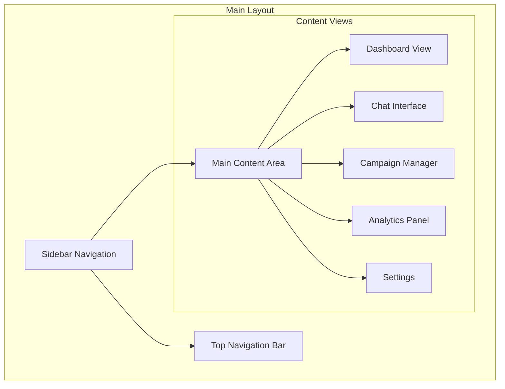
```mermaid
flowchart TB
    subgraph Main Layout
        A[Sidebar Navigation] --> B[Main Content Area]
        A --> C[Top Navigation Bar]
        
        subgraph Content Views
            B --> D[Dashboard View]
            B --> E[Chat Interface]
            B --> F[Campaign Manager]
            B --> G[Analytics Panel]
            B --> H[Settings]
        end
    end
```

### 5.1.2 Key Interface Components

| Component | Layout | Functionality |
|-----------|---------|--------------|
| Chat Interface | Split view with chat list and conversation | - Real-time message display<br>- AI toggle switch<br>- Media attachment support<br>- Contact information sidebar |
| Dashboard | Card-based grid layout | - Key metrics cards<br>- Quick action buttons<br>- Recent activity feed<br>- AI insights panel |
| Campaign Manager | Three-column layout | - Campaign list<br>- Template editor<br>- Preview panel |
| Analytics | Full-width charts and tables | - Interactive visualizations<br>- Date range selector<br>- Export controls |

### 5.1.3 Responsive Breakpoints

| Breakpoint | Screen Size | Layout Adjustments |
|------------|-------------|-------------------|
| Mobile | < 640px | - Collapsed sidebar<br>- Stack layout<br>- Touch-optimized controls |
| Tablet | 640px - 1024px | - Mini sidebar<br>- Flexible grid<br>- Hybrid controls |
| Desktop | > 1024px | - Full sidebar<br>- Multi-column layout<br>- Advanced controls |

## 5.2 Database Design

### 5.2.1 Collections Schema

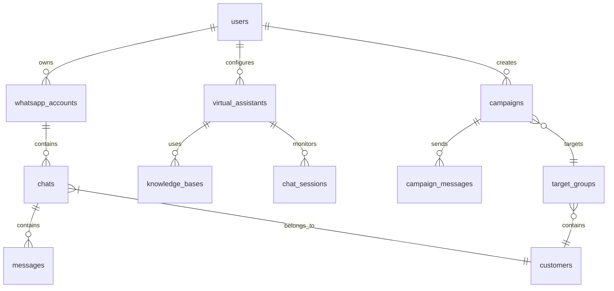
```mermaid
erDiagram
    users ||--o{ whatsapp_accounts : owns
    users ||--o{ virtual_assistants : configures
    users ||--o{ campaigns : creates
    
    whatsapp_accounts ||--o{ chats : contains
    chats ||--o{ messages : contains
    chats }|--|| customers : belongs_to
    
    virtual_assistants ||--o{ knowledge_bases : uses
    virtual_assistants ||--o{ chat_sessions : monitors
    
    campaigns ||--o{ campaign_messages : sends
    campaigns }o--|| target_groups : targets
    target_groups }o--|| customers : contains
```

### 5.2.2 Index Design

| Collection | Index | Purpose | Fields |
|------------|-------|---------|---------|
| chats | customer_lookup | Fast customer chat retrieval | customer_id, created_at |
| messages | chat_timeline | Message chronology | chat_id, timestamp |
| campaigns | status_lookup | Campaign management | status, scheduled_at |
| virtual_assistants | type_lookup | Assistant filtering | type, user_id |

## 5.3 API Design

### 5.3.1 REST Endpoints

| Endpoint | Method | Purpose | Request/Response |
|----------|--------|---------|------------------|
| /api/v1/chats | GET | Retrieve chat list | Pagination, filters |
| /api/v1/messages | POST | Send message | Message content, attachments |
| /api/v1/campaigns | PUT | Update campaign | Campaign configuration |
| /api/v1/assistants | PATCH | Modify assistant | Assistant settings |

### 5.3.2 WebSocket Events

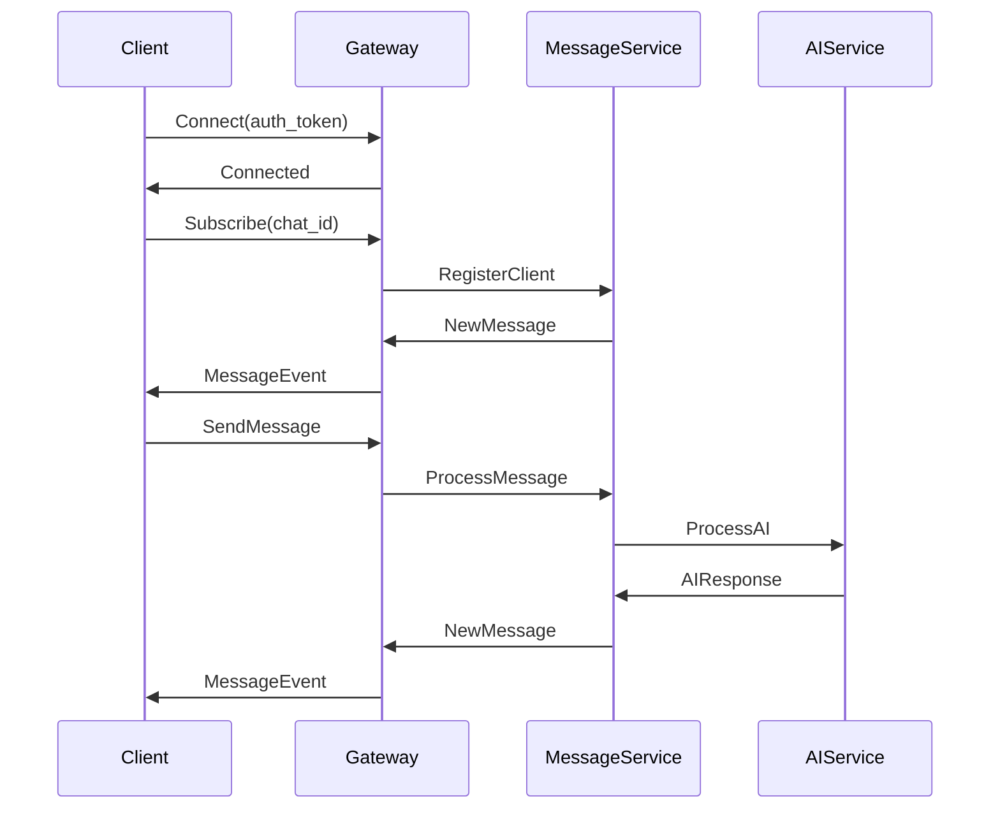
```mermaid
sequenceDiagram
    participant Client
    participant Gateway
    participant MessageService
    participant AIService
    
    Client->>Gateway: Connect(auth_token)
    Gateway->>Client: Connected
    
    Client->>Gateway: Subscribe(chat_id)
    Gateway->>MessageService: RegisterClient
    
    MessageService->>Gateway: NewMessage
    Gateway->>Client: MessageEvent
    
    Client->>Gateway: SendMessage
    Gateway->>MessageService: ProcessMessage
    MessageService->>AIService: ProcessAI
    AIService->>MessageService: AIResponse
    MessageService->>Gateway: NewMessage
    Gateway->>Client: MessageEvent
```

### 5.3.3 Service Integration

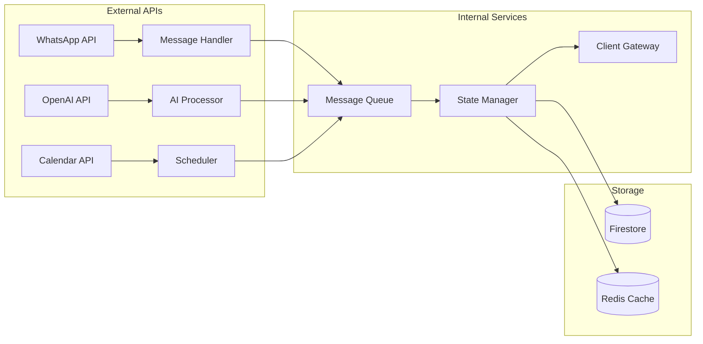
```mermaid
flowchart LR
    subgraph External APIs
        A[WhatsApp API] --> B[Message Handler]
        C[OpenAI API] --> D[AI Processor]
        E[Calendar API] --> F[Scheduler]
    end
    
    subgraph Internal Services
        B --> G[Message Queue]
        D --> G
        F --> G
        G --> H[State Manager]
        H --> I[Client Gateway]
    end
    
    subgraph Storage
        H --> J[(Firestore)]
        H --> K[(Redis Cache)]
    end
```

### 5.3.4 API Security

| Layer | Implementation | Purpose |
|-------|---------------|---------|
| Authentication | JWT + Firebase | Identity verification |
| Authorization | RBAC | Access control |
| Rate Limiting | Token bucket | Resource protection |
| Encryption | TLS 1.3 | Data in transit |
| API Keys | Rotating keys | External service auth |

# 6. USER INTERFACE DESIGN

## 6.1 Layout Components

### 6.1.1 Main Dashboard
```
+----------------------------------------------------------+
|  [#] Porfin                                    [@] [=] [?] |
+------------------+-----------------------------------+-----+
|                  |                                         |
| [#] Dashboard    |  Performance Overview                   |
| [*] Chats        |  +--------------------------------+    |
| [$] Campaigns    |  | Leads: 145    Conversion: 68%  |    |
| [@] Customers    |  | Active: 89    Response: 98%    |    |
| [!] Analytics    |  +--------------------------------+    |
| [=] Settings     |                                        |
|                  |  Recent Activities                      |
|                  |  +--------------------------------+    |
|                  |  | [!] New lead from WhatsApp     |    |
|                  |  | [i] Campaign "Dec23" completed |    |
|                  |  | [$] Payment received #1234     |    |
|                  |  +--------------------------------+    |
|                  |                                        |
+------------------+----------------------------------------+
```

### 6.1.2 Chat Interface
```
+----------------------------------------------------------+
| Chats                                    [+] New Chat      |
+------------------+-----------------------------------+-----+
| Search: [......] |  Maria Silva                    [=]    |
|------------------| +--------------------------------+     |
| Active Chats     | | Hi, I'd like to schedule an    |     |
| +- Maria Silva   | | appointment for next week.     |     |
| +- João Santos   | +--------------------------------+     |
| +- Ana Oliveira  |                                        |
|                  | +--------------------------------+     |
| Recent           | | Of course! Let me check our    |     |
| +- Carlos Lima   | | available slots.               |     |
| +- Paula Costa   | +--------------------------------+     |
|                  |                                        |
|------------------| AI Assistant: (•) On  ( ) Off          |
|                  | [.......................................] |
|                  | [Send]     [^]     [=]                 |
+------------------+----------------------------------------+
```

### 6.1.3 Campaign Manager
```
+----------------------------------------------------------+
| Campaigns                                [+] New Campaign  |
+------------------+-----------------------------------+-----+
| Active (3)       | Campaign Details                        |
| +- End of Year   | Name: [........................]        |
| +- Follow-up     | Type: [v] One-time                     |
| +- Welcome       |                                        |
|                  | Target Audience                         |
| Draft (2)        | [ ] New Leads                          |
| +- January Promo | [ ] Active Patients                    |
| +- Recall        | [ ] Post-Treatment                     |
|                  |                                        |
|                  | Message Template                        |
|                  | +--------------------------------+     |
|                  | | Hello {{name}},                |     |
|                  | | We have a special...           |     |
|                  | +--------------------------------+     |
|                  | [Test]  [Schedule]  [Save Draft]       |
+------------------+----------------------------------------+
```

### 6.1.4 Virtual Assistant Configuration
```
+----------------------------------------------------------+
| AI Assistant Settings                     [Save] [Cancel]  |
+------------------+-----------------------------------+-----+
| Assistants       | Configuration                           |
| +- Lead Conv.    | Name: [Sales Assistant.............]    |
| +- Sales         | Role: [v] Sales Negotiation            |
| +- Support       |                                        |
|                  | Knowledge Base                          |
| Templates        | [^] Upload Documents                    |
| +- Greetings     | +--------------------------------+     |
| +- Pricing       | | - Pricing_2023.pdf             |     |
| +- FAQ          | | - Treatment_Plans.doc          |     |
|                  | | - Payment_Options.xlsx         |     |
|                  | +--------------------------------+     |
|                  |                                        |
|                  | Test Conversation                      |
|                  | [Start Test Chat]                      |
+------------------+----------------------------------------+
```

## 6.2 Component Key

### Navigation Elements
- [#] - Dashboard/Menu icon
- [@] - User profile
- [=] - Settings
- [?] - Help
- [<] [>] - Navigation arrows
- [!] - Notifications/Alerts

### Interactive Elements
- [...] - Text input field
- [ ] - Checkbox
- ( ) - Radio button
- [v] - Dropdown menu
- [Button] - Clickable button
- [^] - File upload

### Status Indicators
- [*] - Favorites/Important
- [$] - Financial/Payment related
- [i] - Information
- [+] - Add/Create new
- [x] - Close/Delete

## 6.3 Responsive Breakpoints

| Breakpoint | Width | Layout Adjustments |
|------------|-------|-------------------|
| Mobile | < 640px | Single column, collapsible sidebar |
| Tablet | 640px - 1024px | Two-column, mini sidebar |
| Desktop | > 1024px | Full three-column layout |

## 6.4 Theme Support

```
Color Scheme Variables:
--primary: #0066CC
--secondary: #4A90E2
--accent: #00CC99
--warning: #FFB020
--error: #FF4D4D
--success: #00CC66
--background: #FFFFFF
--text: #2C3E50
--border: #E5E7EB
```

## 6.5 Accessibility Features

- ARIA landmarks for screen readers
- Keyboard navigation support
- High contrast mode
- Minimum touch target size: 44px
- Focus indicators
- Alt text for all images
- Error messages with icons and colors

## 6.6 Loading States

```
+----------------------------------+
|          Loading Content         |
|          [====    ]  60%         |
|     Please wait a moment...      |
+----------------------------------+
```

## 6.7 Error States

```
+----------------------------------+
|     [!] Error Occurred          |
|     Unable to load chat          |
|     [Try Again]  [Cancel]        |
+----------------------------------+
```

# 7. SECURITY CONSIDERATIONS

## 7.1 AUTHENTICATION AND AUTHORIZATION

### 7.1.1 Authentication Methods

| Method | Implementation | Purpose |
|--------|----------------|----------|
| Firebase Auth | Primary authentication service | User identity management |
| OAuth 2.0 | Google Sign-In integration | Social authentication |
| JWT | Session management | API authentication |
| MFA | Optional two-factor authentication | Enhanced security |

### 7.1.2 Authorization Model

```mermaid
flowchart TB
    subgraph RBAC Model
        A[User Request] --> B{Authentication}
        B -->|Valid| C{Role Check}
        B -->|Invalid| D[401 Unauthorized]
        
        C -->|Admin| E[Full Access]
        C -->|Manager| F[Limited Access]
        C -->|Secretary| G[Basic Access]
        C -->|Invalid Role| H[403 Forbidden]
        
        E --> I[Resource Access]
        F --> I
        G --> I
    end
```

### 7.1.3 Role Permissions Matrix

| Feature | Admin | Manager | Secretary |
|---------|--------|----------|-----------|
| User Management | Full | View Only | None |
| WhatsApp Config | Full | Limited | None |
| Chat Access | Full | Full | Limited |
| Campaign Management | Full | Create/Edit | View Only |
| Analytics | Full | Limited | Basic |
| Virtual Assistant Config | Full | Limited | None |

## 7.2 DATA SECURITY

### 7.2.1 Encryption Standards

| Data State | Method | Implementation |
|------------|--------|----------------|
| In Transit | TLS 1.3 | HTTPS/WSS protocols |
| At Rest | AES-256 | Google Cloud KMS |
| Database | Field-level encryption | Firestore security rules |
| Backups | Client-side encryption | Cloud Storage encryption |

### 7.2.2 Data Classification

```mermaid
flowchart LR
    subgraph Data Classification
        A[Data Input] --> B{Classification}
        B --> C[Public]
        B --> D[Internal]
        B --> E[Confidential]
        B --> F[Restricted]
        
        C --> G[No Encryption]
        D --> H[Basic Encryption]
        E --> I[Strong Encryption]
        F --> J[Maximum Security]
    end
```

### 7.2.3 Data Protection Measures

| Category | Protection Method | Implementation |
|----------|------------------|----------------|
| Patient Data | LGPD compliance | Data minimization, consent management |
| Messages | End-to-end encryption | WhatsApp protocol |
| Payment Info | PCI DSS compliance | Tokenization |
| Audit Logs | Immutable storage | Separate secure storage |

## 7.3 SECURITY PROTOCOLS

### 7.3.1 Access Control

```mermaid
sequenceDiagram
    participant User
    participant Gateway
    participant Auth
    participant Service
    participant Logs
    
    User->>Gateway: Request + JWT
    Gateway->>Auth: Validate Token
    Auth->>Gateway: Token Status
    
    alt Valid Token
        Gateway->>Service: Forward Request
        Service->>Logs: Log Access
        Service->>Gateway: Response
        Gateway->>User: 200 OK
    else Invalid Token
        Gateway->>Logs: Log Attempt
        Gateway->>User: 401 Unauthorized
    end
```

### 7.3.2 Security Monitoring

| Component | Monitoring Method | Alert Threshold |
|-----------|------------------|-----------------|
| Failed Logins | Rate monitoring | >5 attempts/minute |
| API Usage | Request pattern analysis | Unusual patterns |
| Data Access | Audit logging | Unauthorized attempts |
| System Health | Resource monitoring | Performance anomalies |

### 7.3.3 Security Compliance

| Standard | Requirement | Implementation |
|----------|-------------|----------------|
| LGPD | Data privacy | Privacy by design |
| OWASP | Web security | Security best practices |
| ISO 27001 | Information security | Security controls |
| CFM 1.821/07 | Medical data | Healthcare compliance |

### 7.3.4 Incident Response

```mermaid
flowchart TB
    subgraph Incident Response
        A[Detection] --> B{Severity}
        B -->|High| C[Immediate Response]
        B -->|Medium| D[Scheduled Response]
        B -->|Low| E[Routine Response]
        
        C --> F[Containment]
        D --> F
        E --> F
        
        F --> G[Investigation]
        G --> H[Resolution]
        H --> I[Post-Mortem]
    end
```

### 7.3.5 Security Maintenance

| Activity | Frequency | Description |
|----------|-----------|-------------|
| Security Patches | Weekly | System updates and patches |
| Vulnerability Scans | Daily | Automated security scanning |
| Penetration Testing | Quarterly | Third-party security testing |
| Access Review | Monthly | User access audit |
| Security Training | Quarterly | Staff security awareness |

# 8. INFRASTRUCTURE

## 8.1 DEPLOYMENT ENVIRONMENT

| Environment | Configuration | Purpose |
|-------------|--------------|----------|
| Development | GCP Cloud Run | Local development and testing |
| Staging | GCP GKE | Pre-production validation |
| Production | GCP GKE | Live system deployment |
| DR Site | GCP GKE (Secondary Region) | Disaster recovery |

### Environment Specifications

```mermaid
flowchart TB
    subgraph Production Environment
        A[Load Balancer] --> B[Cloud Armor]
        B --> C[GKE Cluster]
        C --> D[Application Pods]
        D --> E[Cloud SQL]
        D --> F[Firestore]
        D --> G[Redis]
        
        H[Cloud CDN] --> I[Static Assets]
        J[Cloud Storage] --> K[Media Files]
    end
```

## 8.2 CLOUD SERVICES

| Service | Purpose | Configuration |
|---------|---------|--------------|
| Google Kubernetes Engine | Container orchestration | - Autopilot mode<br>- Multi-zone deployment<br>- Node auto-scaling |
| Cloud Run | Serverless containers | - Request-based scaling<br>- Memory: 2GB<br>- CPU: 2 vCPU |
| Cloud Storage | Static/media storage | - Multi-regional<br>- Lifecycle management<br>- CDN integration |
| Firestore | NoSQL database | - Native mode<br>- Multi-region replication<br>- Automatic scaling |
| Cloud Memorystore | Redis cache | - 5GB memory<br>- High availability<br>- Version: 6.x |
| Cloud Build | CI/CD pipeline | - Docker support<br>- GitHub integration<br>- Automated testing |

## 8.3 CONTAINERIZATION

### Container Strategy

```mermaid
flowchart LR
    subgraph Base Images
        A[Python 3.11] --> B[FastAPI App]
        C[Node 18] --> D[Next.js App]
    end
    
    subgraph Services
        B --> E[API Service]
        B --> F[Worker Service]
        D --> G[Web Frontend]
    end
    
    subgraph Registry
        E --> H[Container Registry]
        F --> H
        G --> H
    end
```

### Container Specifications

| Service | Base Image | Resources |
|---------|------------|-----------|
| API Service | python:3.11-slim | CPU: 1-2 cores<br>Memory: 1-2GB |
| Worker Service | python:3.11-slim | CPU: 2-4 cores<br>Memory: 2-4GB |
| Web Frontend | node:18-alpine | CPU: 0.5-1 core<br>Memory: 512MB |
| AI Service | python:3.11-slim | CPU: 2-4 cores<br>Memory: 4-8GB |

## 8.4 ORCHESTRATION

### Kubernetes Configuration

```mermaid
flowchart TB
    subgraph GKE Cluster
        A[Ingress Controller] --> B[Service Mesh]
        B --> C[Application Services]
        
        subgraph Workloads
            C --> D[API Pods]
            C --> E[Worker Pods]
            C --> F[Frontend Pods]
        end
        
        subgraph Storage
            G[(Persistent Volumes)]
            H[(ConfigMaps)]
            I[(Secrets)]
        end
    end
```

### Cluster Specifications

| Component | Configuration | Scaling Policy |
|-----------|--------------|----------------|
| Node Pools | - e2-standard-4<br>- Preemptible nodes<br>- SSD boot disks | - Min nodes: 3<br>- Max nodes: 15<br>- Auto-scaling |
| Pod Resources | - Request/Limit ratios<br>- Resource quotas<br>- HPA configuration | - CPU threshold: 70%<br>- Memory threshold: 80% |
| Network Policy | - Calico CNI<br>- Pod security policies<br>- Network isolation | - Ingress/Egress rules<br>- Service mesh integration |

## 8.5 CI/CD PIPELINE

### Pipeline Architecture

```mermaid
flowchart LR
    subgraph Source
        A[GitHub] --> B[Cloud Build Trigger]
    end
    
    subgraph Build
        B --> C[Unit Tests]
        C --> D[Build Images]
        D --> E[Security Scan]
    end
    
    subgraph Deploy
        E --> F{Environment}
        F -->|Staging| G[Staging Cluster]
        F -->|Production| H[Production Cluster]
        
        G --> I[Smoke Tests]
        I --> J[Monitor]
        
        H --> K[Canary Deploy]
        K --> L[Full Deploy]
    end
```

### Pipeline Stages

| Stage | Actions | Success Criteria |
|-------|---------|-----------------|
| Build | - Code checkout<br>- Dependency installation<br>- Unit tests<br>- Container builds | - All tests pass<br>- Build succeeds<br>- No vulnerabilities |
| Test | - Integration tests<br>- Security scans<br>- Performance tests | - 80% code coverage<br>- No critical issues<br>- Performance SLAs met |
| Deploy | - Staging deployment<br>- Smoke tests<br>- Production canary<br>- Full rollout | - Zero downtime<br>- Health checks pass<br>- Metrics within bounds |
| Monitor | - Performance monitoring<br>- Error tracking<br>- Usage metrics | - Error rate < 0.1%<br>- Latency < 500ms<br>- 99.9% uptime |

### Deployment Strategy

| Type | Method | Rollback Plan |
|------|--------|--------------|
| Staging | Blue/Green | Immediate DNS switch |
| Production | Canary | Progressive rollout |
| Hotfix | Direct Deploy | Version revert |
| Database | Zero-downtime | Automated backups |

# APPENDICES

## A.1 ADDITIONAL TECHNICAL INFORMATION

### A.1.1 WhatsApp Integration Details

| Component | Implementation | Details |
|-----------|----------------|----------|
| Baileys Library | Node.js/Python wrapper | - Multi-device support<br>- QR code authentication<br>- Message queuing |
| Official API | REST/Webhook | - Business verification required<br>- Rate limits: 80 msg/sec<br>- 24-hour customer service window |
| Message Types | Supported formats | - Text, Image, Document<br>- Audio, Video<br>- Location, Contact |

### A.1.2 AI Processing Pipeline

```mermaid
flowchart TB
    subgraph Input Processing
        A[Raw Message] --> B[Text Extraction]
        B --> C[Language Detection]
        C --> D[Intent Classification]
    end
    
    subgraph AI Processing
        D --> E[Context Building]
        E --> F[GPT-4 Processing]
        F --> G[Response Generation]
    end
    
    subgraph Output Processing
        G --> H[Response Validation]
        H --> I[Format Conversion]
        I --> J[Delivery Queue]
    end
```

### A.1.3 Payment Integration Flow

```mermaid
sequenceDiagram
    participant C as Customer
    participant A as AI Assistant
    participant P as Payment Gateway
    participant S as System
    
    C->>A: Request payment
    A->>P: Generate payment link
    P->>A: Payment URL
    A->>C: Share payment options
    C->>P: Complete payment
    P->>S: Payment notification
    S->>A: Update payment status
    A->>C: Confirm payment
```

## A.2 GLOSSARY

| Term | Definition |
|------|------------|
| Virtual Assistant | AI-powered agent handling automated customer interactions |
| Knowledge Base | Collection of documents and data used to train AI assistants |
| Campaign | Automated series of scheduled WhatsApp messages |
| Sales Funnel | Customer journey stages from initial contact to post-treatment |
| Jinja Template | Text templating system for message personalization |
| Webhook | HTTP callback for real-time event notifications |
| PIX | Brazilian instant payment system |
| Blue-Green Deployment | Deployment strategy using two identical environments |
| Canary Release | Gradual rollout of new features to subset of users |
| Multi-tenancy | Architecture supporting multiple isolated customer instances |

## A.3 ACRONYMS

| Acronym | Full Form |
|---------|-----------|
| API | Application Programming Interface |
| CDN | Content Delivery Network |
| CRM | Customer Relationship Management |
| DNS | Domain Name System |
| GDPR | General Data Protection Regulation |
| gRPC | Google Remote Procedure Call |
| HTTPS | Hypertext Transfer Protocol Secure |
| JWT | JSON Web Token |
| LGPD | Lei Geral de Proteção de Dados |
| LLM | Large Language Model |
| MFA | Multi-Factor Authentication |
| NLU | Natural Language Understanding |
| OAuth | Open Authorization |
| RBAC | Role-Based Access Control |
| REST | Representational State Transfer |
| SaaS | Software as a Service |
| SDK | Software Development Kit |
| SLA | Service Level Agreement |
| SSL | Secure Sockets Layer |
| TLS | Transport Layer Security |
| URL | Uniform Resource Locator |
| WAF | Web Application Firewall |
| WSS | WebSocket Secure |

## A.4 REFERENCE ARCHITECTURE

```mermaid
C4Context
    title Reference Architecture Overview
    
    Person(user, "Healthcare Professional", "System user")
    
    System_Boundary(porfin, "Porfin Platform") {
        Container(web, "Web Application", "Next.js")
        Container(api, "API Gateway", "FastAPI")
        Container(ai, "AI Service", "Python/GPT-4")
        Container(msg, "Message Service", "Python/Baileys")
        ContainerDb(db, "Database", "Firestore")
        ContainerDb(cache, "Cache", "Redis")
    }
    
    System_Ext(whatsapp, "WhatsApp Business")
    System_Ext(calendar, "Google Calendar")
    System_Ext(payment, "Payment Gateways")
    
    Rel(user, web, "Uses", "HTTPS")
    Rel(web, api, "Calls", "REST/WSS")
    Rel(api, ai, "Processes", "gRPC")
    Rel(api, msg, "Routes", "gRPC")
    Rel(msg, whatsapp, "Integrates", "API")
    Rel(ai, calendar, "Schedules", "API")
    Rel(ai, payment, "Processes", "API")
```